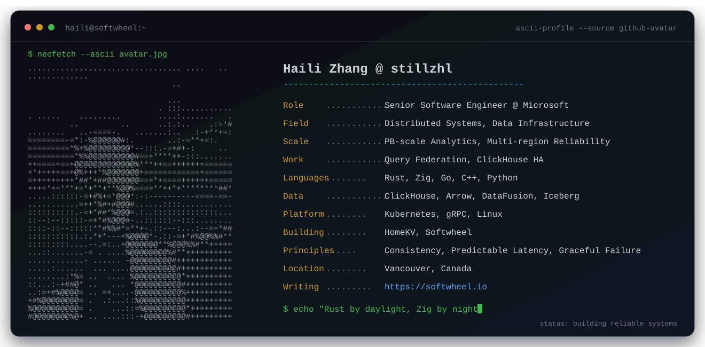

  

  
  
  

### `> selected_work`

<table>
<tr>
<td width="50%" valign="top">

#### [HomeKV](https://github.com/stillzhl/homekv)

A Rust key-value store evolving from MVCC toward a strongly consistent, distributed in-memory data plane.

`Rust` · `MVCC` · `Raft` · `gRPC`

</td>
<td width="50%" valign="top">

#### [Softwheel](https://softwheel.io)

Technical deep dives into databases and distributed systems—building the wheel to understand why it works.

`Databases` · `Rust` · `Distributed Systems`

</td>
</tr>
</table>

### `> telemetry`

  
  

